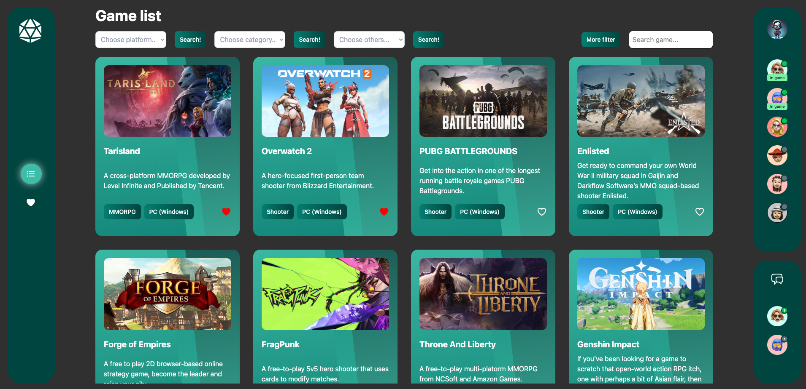

# 🎮 Gamezone



This project is a **game dashboard** built to strengthen my understanding of key front-end technologies, including:

- **Redux** for global state management  
- **Thunk functions** for handling asynchronous logic  
- **React Router** for client-side routing

## 🛠 Technologies Used

- **React**
- **Redux Toolkit + Redux Thunk**
- **React Router DOM**
- **TawilwindCSS**
- **Public game API**

## 🧠 What I Learned

- How to manage and structure global state effectively using Redux
- How to write and organize **thunk functions** for async API calls
- Best practices for using **React Router** in a multi-page front-end application
- Organizing scalable and modular components for better code maintainability

## 🚀 Getting Started

Clone the repository and install dependencies:

```bash
git clone https://github.com/your-username/game-dashboard.git
cd game-dashboard
npm install
npm start
